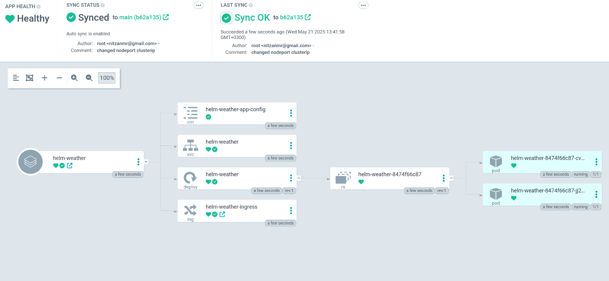
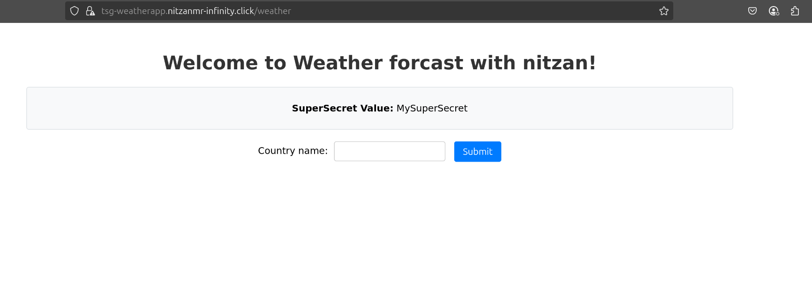
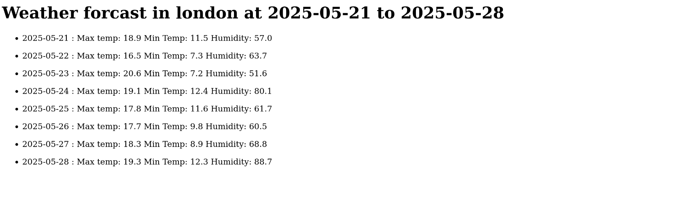

# Tsg-project-azure

This repository contains a Helm chart for deploying the WeatherApp application on Kubernetes. The chart provides configuration for deployment, service, ingress, and integration with Vault for secrets management.

The helm chart uses the container created in this repo : 
<href>https://github.com/nitzanmr/wetherapp-TSG</href>

This repo in combenation with wetherapp-tsg are the projects code. 
In this project i created infestructure on Azure cp. 
This project contains a public instance that inside it runs an azure devops agent. and a Hashicorp vault container. 
The vault need to be unsealed for the project to work and for you to be able to access it. 


## Architecture
https://github.com/nitzanmr/helm-weather-tsg/blob/main/TSG-Project-Arch.png</img>

##ArgoCD


##Weatherapp



## Descions:
 - Self hosted vault and agent. the public ip was used only to access the instance via ssh, can use bastion to access privatly. 
 - Application connected to vault and taking the secret of the weather_api from it via a token. (next ill try and create a role base for kubernetes to access the data) - switched because it is the same process but with api token i needed.
 - Dockerhub is accessed via a PAT.
 - Used github instead of azure devops repo - instructed by instructure.
 - Created AKS via the gui configured use of calico for better scailablity.
 - AKS can be accessed only from my pc diceded via an ip. 
 - Created an ingress controller with the command: kubectl create --filename https://raw.githubusercontent.com/kubernetes/ingress-nginx/controller-v1.8.2/deploy/static/provider/cloud/deploy.yaml - tried with helm install but there is a problem with the latest version.
 - The self hosted agent is on the Default node group and is configured locally as instructed in adding an agent.
 - Argocd is installed on the cluster via HELM from https://github.com/argoproj/argo-helm/tree/main/charts/argo-cd
 - Deployment is handled via this repo with a pull mechanism with argocd.
 - App is routed with ingress at port 80 and 443 and can be accessed at the route /weather
 - The ingress is forwarding the traffic to the app via the nodeport. (can also be a ClusterIP)
 - The ingress is creating a LB which has access to the internet currently all of it. ill prefer to limit it to our company. choose it because i tried to create a agic but didnt have the time for it. 
 - The Pipeline is changing the version of the container inside of the values.yaml file in this repo. it is then gets updated in argocd. 
 - Argocd is working with a pull based timeline of 10 min sync.
 

## Features

- Deploys the WeatherApp as a scalable Kubernetes Deployment.
- Exposes the app via a Kubernetes Service (ClusterIP, or LoadBalancer).
- Optional Ingress support with customizable paths and annotations.
- Configurable resource requests and limits.
- Supports Docker image pull secrets.
- Integrates with Vault for secret management.
- Easily customizable via `values.yaml`.

## Prerequisites

- Helm - (https://helm.sh/)
- Kubernetes cluster - AKS
- Vault - (https://www.vaultproject.io/) for secrets management
- DockerHub credentials (if using a private image)
- Nginx ingress controller or other ingress controller.

## Installation

1. **Clone the repository:**
   ```sh
   git clone https://gitlab.com/nitzanmr/helm_weather.git
   cd helm-weather-tsg
2. **configure azure cli**
    ```sh
    azure login
3. **configure Azure AKS Kubectl**
    ```sh
    az aks get-credentials --resource-group NetworkWatcherRG --name TSGAKS --overwrite-existing

4. **Create Vault Secret:**
   ```sh
    export VAULT_TOKEN=your-vault-token
    kubectl create secret generic vault-token --from-literal=token=$VAULT_TOKEN

5. **Create DockerHub Pull Secret:**
   ```sh
    kubectl create secret docker-registry dockerhub \
    --docker-username=<your-username> \
    --docker-password=<your-password> \
    --docker-email=<your-email>
6. **Kubectl install nginx controller**
    ```sh
    kubectl create --filename https://raw.githubusercontent.com/kubernetes/ingress-nginx/controller-v1.8.2/deploy/static/provider/cloud/deploy.yaml

7. **helm install weatherapp**

    for overiding the defaults:
    helm install weatherapp . -f my-values.yaml

## Configuration
    See values.yaml for all configurable options.

    Key options:

    * replicaCount: Number of app replicas.
    * image.repository, image.tag: Docker image settings.
    * service.type: Service type (ClusterIP, LoadBalancer).
    * ingress.enabled: Enable/disable ingress.
    * config.bgColor: Background color for the app UI.

## Validation
    You can check the ip of the ingress with 
    ```sh 
    kubectl get ingress -A
    ```
    It will be under ADDRESS.
    you can access the app via the https://ADDRESS/weather
    
